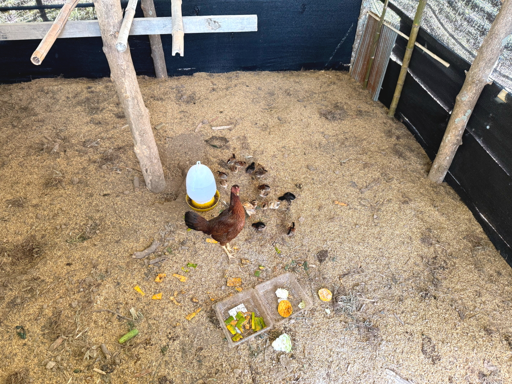
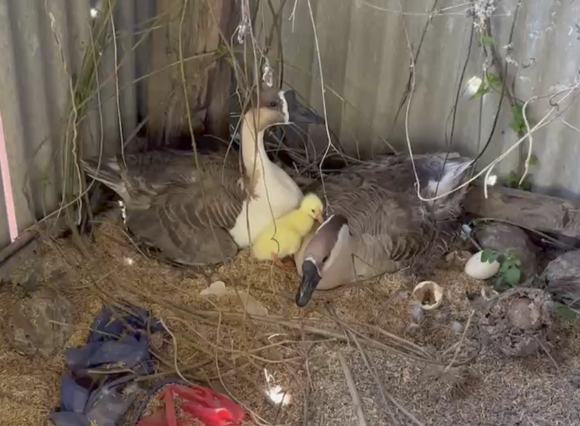
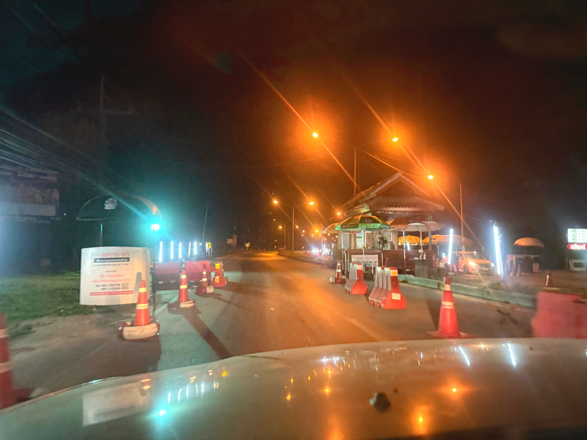

# 20250119_chiangrai

<html>
<head>

<meta charset="UTF-8">
<meta http-equiv="Content-Type" content="text/html; charset=UTF-8">
<meta http-equiv="X-UA-Compatible" content="IE=EmulateIE10" />
<meta http-equiv="X-UA-Compatible" content="IE=edge">

<!--ここから上はお決まりの定型文です-->

<!--ここからが表現の書式などを決めるcssという部分-->

<link href="https://cdnjs.cloudflare.com/ajax/libs/lightbox2/2.7.1/css/lightbox.css" rel="stylesheet">

</head>

<body>

モバイル端末をお使いの場合は、画面を横向きにすると
より見やすくご覧頂けます。

<!--ここ上は、ほぼそのまま使います！-->

<!--QRコードの挿入例-->

 アクセス用QRコード

<marquee direction="left" scrollamount="20" width="30%">(^_^)/~alis</marquee>

<!--流れ文字の挿入例-->
<h1><marquee behavior="left">!!! 2025/01/19、じゃれつく猫から、街の映像まで!!!</marquee></h1>

                          

<!--ここから下が、本体部分-->

<h2>3日続けて西の空にお月様が沈んで行く映像からスタートです 同じような時間帯ですがかなり高いところに残ってます 19日 7:04</h2>

<h2>昨日よりさらに太陽に近づいて、掛け方はさらに大きくなりました</h2>

<h2>ちょっと遅れて東の空からお日様が顔を出しました、19日朝7:15</h2>

<h2>いつもの猫が足元にじゃれつきます</h2>

<h2>太陽が完全に昇るとハスのお花達も満開</h2>

<h2>めんどりは20羽の子育てで大忙し</h2>

<iframe width="560" height="315" src="https://www.youtube.com/embed/vhYT1xpp3AQ?si=KAVg8Zix5IyQkJgW" title="YouTube video player" frameborder="0" allow="accelerometer; autoplay; clipboard-write; encrypted-media; gyroscope; picture-in-picture; web-share" referrerpolicy="strict-origin-when-cross-origin" allowfullscreen></iframe> 

<h2>雑草ですが、お花は綺麗です</h2>

<h2>ミツバチの後ろ足は花粉でいっぱい</h2>

<h2>アヒルの白はオス、鶏のオスとは仲良しです</h2>

<h2>アヒルには雛が孵っていてメスたちは子育て中</h2>

<h2>ランのお花は一度咲くと長持ちです</h2>

<h2>夕陽を浴びて庭の木々が黄色味を帯びます</h2>

<h2>はの上で鳥が休憩</h2>

<h2>椰子の実がたくさん実りました</h2>

<h2>この高さでは収穫はプロにお願いします</h2>

<h2>夕方は荷物運びのお手伝いで街に移動</h2>

<h2>選挙が近くなって、道にはポスターが乱立</h2>

<iframe width="560" height="315" src="https://www.youtube.com/embed/g7Q01NKXIy0?si=ZD7eLbB5rxfKlPuY" title="YouTube video player" frameborder="0" allow="accelerometer; autoplay; clipboard-write; encrypted-media; gyroscope; picture-in-picture; web-share" referrerpolicy="strict-origin-when-cross-origin" allowfullscreen></iframe> 

<h2>街の周辺は普段着、ノーヘルのスクータでいっぱい</h2>

<h2>プロのスクーターはヘルメット被ります</h2>

<h2>国道から曲がった道路は賑やかな商店街</h2>

<h2>街中の狭い空にも宵の明星「金星」が輝きます よく見ると左側に「土星」も見えます</h2>

<h2>夜の7時半すぎですが、街の近くはスクータだらけ</h2>

<h2>市街地エリアを離れた国道だとこんな感じ</h2>

<h2>不法入国者取り締まりの検問</h2>

<h2>肝心の警官さんは誰もいませんでした</h2>

<h2>運んだ荷物は丸テーブル、タイの家具はすごく重いです</h2>

   
<h2>以上、3日連続で朝一の東の空に沈みゆく月からスタートでした。 久しぶりに賑わう街の映像もアップできました。 ここまで観ていただきありがとうございました。</h2>

     
<h2>
<a href="https://torokoid.github.io/20241126_chiangrai/" target="_blank">Back to the menu page</a>
</h2>

   

         

  

      

<!--本体はここまで-->

<!--画面に空白地帯を作って、背景が見えるようにしています-->
                                              

<!-- フッタ -->
<footer>

Copyright 2025/01/20 alis @ChiangRai

</footer>

<!--HPにさまざまなJavaScriptを呼び込むための書式-->

